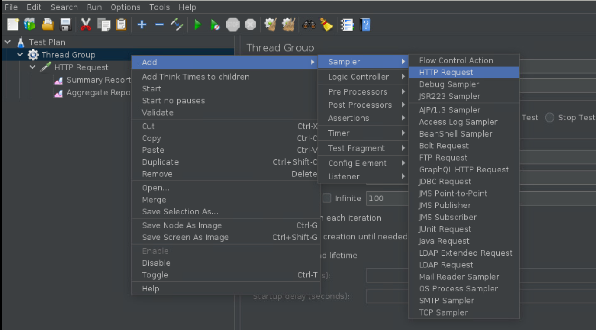
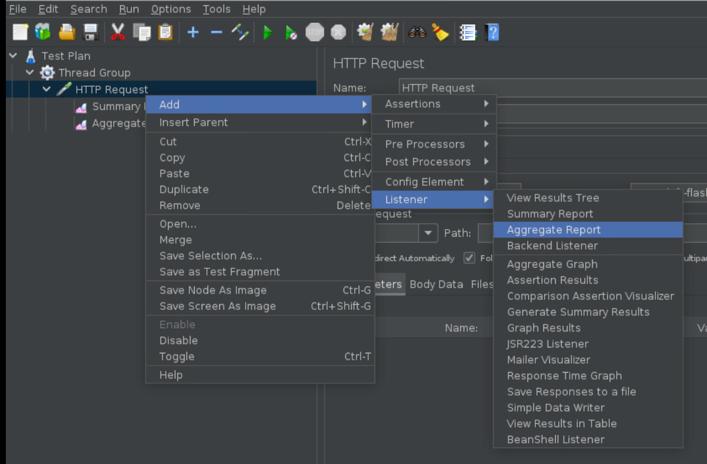
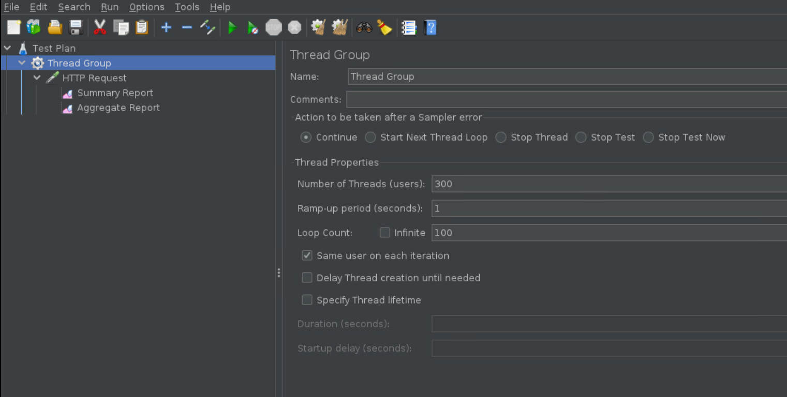
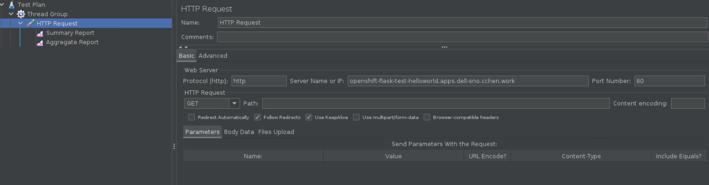
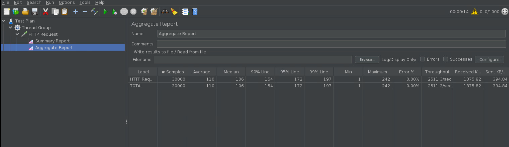

# Installation

## Install openjdk 1.8

~~~bash

$ yum install openjdk-1.8

~~~

## Download Jmeter Binary

~~~bash

$ cd ~/Downloads
$ wget https://archive.apache.org/dist/jmeter/binaries/apache-jmeter-5.5.tgz

$ mkdir /usr/local/jmeter
$ cp ~/Downloads/apache-jmeter-5.5.tgz /usr/local/jmeter
$ tar xvf /usr/local/jmeter/apache-jmeter-5.5.tgz
~~~

## Configure Environment Variables

~~~bash
$ tail -n 2 ~/.bashrc
export JMETER_HOME=/usr/local/jmeter/apache-jmeter-5.5
export PATH=${JMETER_HOME}/bin:$PATH
~~~

## Run Some Test

* We firstly add `http request sampler` under `Threads Groups`

* Then we add `aggregate report` under `HTTP Request`

* Specify the `threads count` and HTTP URL that we'd like to test

* Run the test and check the result

